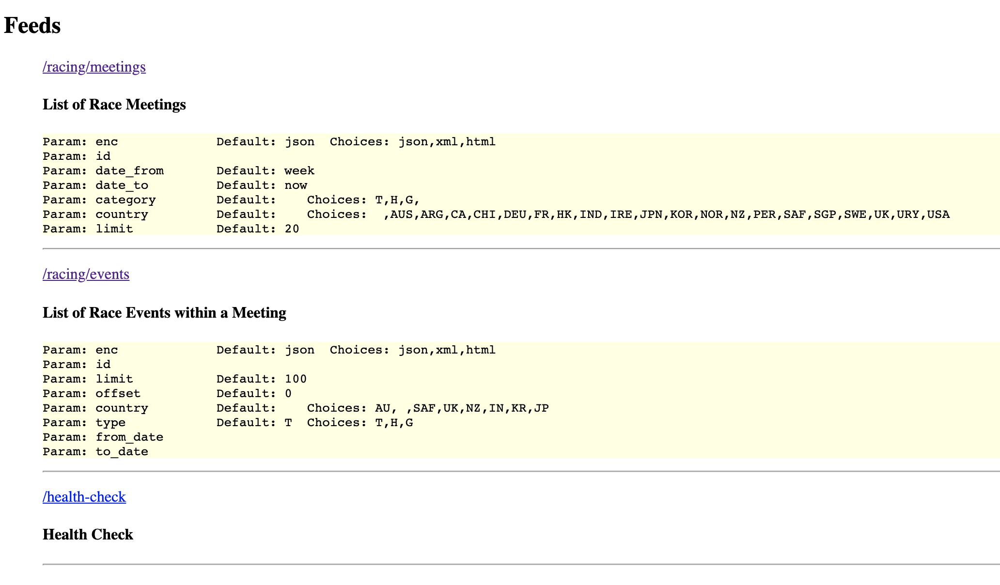

# Documentation for Affiliate Feed services (public)

### Quick Links
[Racing API](README.md#racing-apis) -> 
[Meetings List](README.md#racing-base_urlmeetings) | 
[Meeting Details](README.md#racing-base_urlmeetingsmeeting-id) | 
[Event Details](README.md#racing-base_urleventsevent-id) 

[Sports API](README.md#sports-api) ->
[Competitions List](README.md#sports-base_urlcompetitions) | 
[Competitions Details](README.md#sports-base_urlcompetitionscompetition-id) | 
[Events List](README.md#sports-base_urlevents) |
[Event Details](README.md#sports-base_urleventsevent-id) 

[Other TODO](README.md#other-todo-items) 


### Status 30 AUG 2019
- [x] Added results to racing events
- [x] Empty / blank fields included in all data payloads

- [x] Overview of the structure of the new API
- [x] Overview of working endpoints in new API
- [x] Details of Racing API

TODO
- [ ] Details of Sports API
- [x] Details of Racing Resulting
- [ ] Details of Sports Resulting
- [ ] BetNow Functionality

## Scope

This documentation is provided for external developers who need to write code to poll data from the provided 
sites.

The API itself is designed to be consistent across all endpoints, and provide some built in tools to make
connecting to the API, debugging and maintaining your code that little bit easier.

# API Endpoints - Multiple Brands

All Brands follow the same endpoint syntax, and provide identical output formats.


The base URL for each brand is now as follows: 

- Ladbrokes https://api.ladbrokes.com.au/affiliates/v1
- Neds https://api.neds.com.au/affiliates/v1
- BetStar https://api.betstar.com.au/affiliates/v1
- BookMaker https://api.bookmaker.com.au/affiliates/v1

*Deprecated API*
The base URL for each brand was as follows: 

- Ladbrokes https://api-affiliates.ladbrokes.com.au
- Neds https://api-affiliates.neds.com.au
- BetStar https://api-affiliates.betstar.com.au
- BookMaker https://api-affiliates.bookmaker.com.au

These API endpoints will continue to operate for a short time only, we will definitely be turning these off by Fri, 4th October 2019. 
Please make sure you redirect all your incoming calls through the newly named endpoints before then.


In the document below, we will refer to this as `BASE_URL`

The API provided on the `BASE_URL` uses `HTTPS` protocol - so can be hit from a browser, curl script, or coded using
standard HTTP libs in your prefered development toolkit.

Each API endpoint has a consistent range of `GET` parameters for controlling the returned data.

# UUID format ID Fields

Note that all ID fields across all APIs now use UUIDv4 notation instead of simple integers that
may have been used previously.

MeetingIDs / EventIDs are consistent across all brands, so they can be re-used across 
different `BASE_URL`s to refer the exact same Meeting / Event / Entrant, from one brand to the next.

eg

- https://api-affiliates.ladbrokes.com.au/racing/events/d43cc25b-2b27-4d5d-818e-b2f8b40399e4
- https://api-affiliates.neds.com.au/racing/events/d43cc25b-2b27-4d5d-818e-b2f8b40399e4
- https://api-affiliates.betstar.com.au/racing/events/d43cc25b-2b27-4d5d-818e-b2f8b40399e4
- https://api-affiliates.bookmaker.com.au/racing/events/d43cc25b-2b27-4d5d-818e-b2f8b40399e4

Are 4 different views of the same event, with the pricing data applicable to that brand only.

# Data vs Index API Endpoints

There are 2 classes of API Endpoint provided.

- Index API
- Data API

Index APIs provide HTML formatted index pages for basic queries.
  
These are provided for the developer as an aide for debugging and setting up your application code.

For example, the `BASE_URL` returns a HTML formatted page with a human readable index of what URLs
are available, and how to invoke them.

eg. https://api-affiliates.ladbrokes.com.au gives us this Index, with an example URL in each case,
and a listing of which parameters are accepted.


### Data API endpoints and Encoding types

`JSON` Is the default encoding for the payload on Data APIs

- https://api-affiliates.ladbrokes.com.au/racing/events/d43cc25b-2b27-4d5d-818e-b2f8b40399e4 

returns a JSON payload with the data for the given racing event.

---

`XML` Options - append `.xml` to the URL

- https://api-affiliates.ladbrokes.com.au/racing/events/d43cc25b-2b27-4d5d-818e-b2f8b40399e4.xml

returns an XML payload for the exact same data.

---

`HTML` Options to get a human readable index page of the exact same data, for easy debugging. 

- https://api-affiliates.ladbrokes.com.au/racing/events/d43cc25b-2b27-4d5d-818e-b2f8b40399e4.html

---

Optional - using the `enc` GET parameter to control output encoding format

- `?enc=html`  Returns `HTML` format 
- `?enc=json`  Returns `JSON` format
- `?enc=xml` Returns `XML` format.  (not available on all endpoints)
- `?enc=help` Returns a short description of the available parameters. (Debugging aide)

This is useful, as it can be applied to Index URLs where adding a `.html` is not applicable, such as 

- `JSON` https://api-affiliates.ladbrokes.com.au/racing/meetings for a JSON data payload, vs
- `XML` https://api-affiliates.ladbrokes.com.au/racing/meetings?enc=xml for an XML data payload, vs
- `HTML` https://api-affiliates.ladbrokes.com.au/racing/meetings?enc=html for a human readable view of the same data
- `PARAMETER HELP` https://api-affiliates.ladbrokes.com.au/racing/events/d43cc25b-2b27-4d5d-818e-b2f8b40399e4?enc=help

---

# Input Parameter Formats

Parameters are parsed as presented.

Special treatment of parameters includes :

### `id` fields must be valid UUIDv4 IDs

Conforms to UUID v4 (randomly generated)

as per RFC 4122
https://www.ietf.org/rfc/rfc4122.txt

Useful tool for validating UUIDv4 can be found here
https://www.uuidgenerator.net/version4

### Date Fields

Includes parameters labelled `date_from` and `date_to`.
 
Dates accept strings in the format `YYYY-MM-DD` as well as a selection of keywords :

- `now`  for the current date and time.
- `today`  for the start of the current day.
- `week` for the start of the current week (where Monday is the first day of the week)
- `month` for the start of the current month.
- `all` In the context of `date_from` = all dates.  In the context of `date_to` = current date.

Date ranges can be considered inclusive.

So `date_from=today` includes events greater than or equal to 00:00:00 hrs of the current day.

### Parameters with Choice sets

If the parameter has a `Choices` set (as displayed in the HELP for that API endpoint), then 
the input data must be a member of that set.

ie :

```
Param: category        Default:    Choices: T,H,G, 
```

Then the `?category=VALUE`  must be one of T,H,G for the request to be accepted.


# Racing APIs

Summary of API endpoints for racing
- `BASE_URL`/meetings
- `BASE_URL`/meetings/`MEETING-ID`
- `BASE_URL`/events/`EVENT-ID`

### Racing `BASE_URL`/meetings

- `JSON` https://api-affiliates.ladbrokes.com.au/racing/meetings
- `HTML` https://api-affiliates.ladbrokes.com.au/racing/meetings?enc=html
- `XML` https://api-affiliates.ladbrokes.com.au/racing/meetings?enc=xml

Parameters
```cassandraql
Param: enc             Default: json  Choices: json,xml,html
Param: date_from       Default: week
Param: date_to         Default: now
Param: category        Default:    Choices: T,H,G, 
Param: country         Default:    Choices:  ,AUS,ARG,CA,CHI,DEU,FR,HK,IND,IRE,JPN,KOR,NOR,NZ,PER,SAF,SGP,SWE,UK,URY,USA
Param: limit           Default: 20
```

`Meetings List` Payload Format
```go
type meetingPayload struct {
	Meetings []*meetingData `json:"meetings" xml:"meetings"`
}

type meetingData struct {
	Meeting      string         `json:"meeting" xml:"meeting"`
	Name         string         `json:"name" xml:"name"`
	Date         time.Time      `json:"date" xml:"date"`
	Category     string         `json:"category" xml:"category"`
	CategoryName string         `json:"category_name" xml:"category_name"`
	Country      string         `json:"country" xml:"country"`
	State        string         `json:"state" xml:"state"`
	Races        []*meetingRace `json:"races" xml:"races"`
}

type meetingRace struct {
	ID             string    `json:"id" xml:"id"`
	RaceNumber     uint32    `json:"race_number" xml:"race_number"`
	Name           string    `json:"name" xml:"name"`
	StartTime      time.Time `json:"start_time" xml:"start_time"`
	TrackCondition string    `json:"track_condition" xml:"track_condition"`
	Distance       uint32    `json:"distance" xml:"distance"`
	Weather        string    `json:"weather" xml:"weather"`
	Country        string    `json:"country" xml:"country"`
	State          string    `json:"state" xml:"state"`
}
```

### Racing `BASE_URL`/meetings/`MEETING-ID`

- `JSON` https://api-affiliates.ladbrokes.com.au/racing/meetings/1f2d507d-e4b7-4d14-8463-17842301684b
- `XML` https://api-affiliates.ladbrokes.com.au/racing/meetings/1f2d507d-e4b7-4d14-8463-17842301684b.xml
- `HTML` https://api-affiliates.ladbrokes.com.au/racing/meetings/1f2d507d-e4b7-4d14-8463-17842301684b.html

Parameters
```cassandraql
Param: enc             Default: json  Choices: json,xml,html
```

`Meeting Details` Payload Format
```go
// Still presented as an array as per the Meeting List payload
// but there will be only 1 element in this array
type meetingPayload struct {
	Meetings []*meetingData `json:"meetings" xml:"meetings"`
}

type meetingData struct {
	Meeting      string         `json:"meeting" xml:"meeting"`
	Name         string         `json:"name" xml:"name"`
	Date         time.Time      `json:"date" xml:"date"`
	Category     string         `json:"category" xml:"category"`
	CategoryName string         `json:"category_name" xml:"category_name"`
	Country      string         `json:"country" xml:"country"`
	State        string         `json:"state" xml:"state"`
	Races        []*meetingRace `json:"races" xml:"races"`
}

type meetingRace struct {
	ID             string    `json:"id" xml:"id"`
	RaceNumber     uint32    `json:"race_number" xml:"race_number"`
	Name           string    `json:"name" xml:"name"`
	StartTime      time.Time `json:"start_time" xml:"start_time"`
	TrackCondition string    `json:"track_condition" xml:"track_condition"`
	Distance       uint32    `json:"distance" xml:"distance"`
	Weather        string    `json:"weather" xml:"weather"`
	Country        string    `json:"country" xml:"country"`
	State          string    `json:"state" xml:"state"`
}
```

### Racing `BASE_URL`/events/`EVENT-ID`

- `JSON` https://api-affiliates.ladbrokes.com.au/racing/events/d43cc25b-2b27-4d5d-818e-b2f8b40399e4
- `XML` https://api-affiliates.ladbrokes.com.au/racing/events/d43cc25b-2b27-4d5d-818e-b2f8b40399e4.xml
- `HTML` https://api-affiliates.ladbrokes.com.au/racing/events/d43cc25b-2b27-4d5d-818e-b2f8b40399e4.html

Parameters
```
Param: enc             Default: json  Choices: json,xml,html
```

Note that Results are now added to the event details, as follows 

Event Payload Format
```go
type eventRaceDetails struct {
	Race      eventRace      `json:"race"`
	Results   []*eventResult `json:"results,omitempty"`
	Favourite eventEntrant   `json:"favourite"`
	Runners   []*eventRunner `json:"runners"`
	Mover     eventEntrant   `json:"mover"`
	Error     string         `json:"error"`
}

type eventRace struct {
	EventID               string `json:"event_id"`
	MeetingName           string `json:"meeting_name"`
	MeetingID             string `json:"meeting_id"`
	Status                string `json:"status"`
	Description           string `json:"description"`
	AdvertisedStart       int64  `json:"advertised_start"`
	ActualStart           int64  `json:"actual_start"`
	AdvertisedStartString string `json:"advertised_start_string"`
	ActualStartString     string `json:"actual_start_string"`
	RaceNumber            uint32 `json:"race_number"`
	Type                  string `json:"type"`
	Country               string `json:"country"`
	State                 string `json:"state"`
	Distance              uint32 `json:"distance"`
	Weather               string `json:"weather"`
	FormGuide             string `json:"form_guide"`
	Comment               string `json:"comment"`
	SilkBaseURL           string `json:"silk_base_url"`
	TrackCondition        string `json:"track_condition"`
}

type eventResult struct {
	Position     uint32 `json:"position"`
	Name         string `json:"name"`
	Barrier      uint32 `json:"barrier"`
	RunnerNumber uint32 `json:"runner_number"`
}

type eventEntrant struct {
	EntrantID    string `json:"-"`
	Name         string `json:"name"`
	IsScratched  bool   `json:"is_scratched"`
	ScratchTime  int64  `json:"scratch_time"`
	Barrier      uint32 `json:"barrier"`
	RunnerNumber int    `json:"runner_number"`
	PrizeMoney   string `json:"prize_money"`
	Age          int    `json:"age"`
	Sex          string `json:"sex"`
	Colour       string `json:"colour"`
	SilkColours  string `json:"silk_colours"`
	FormComment  string `json:"form_comment"`
	ClassLevel   string `json:"class_level"`
	Jockey       string `json:"jockey"`
	Country      string `json:"country"`
	TrainerName  string `json:"trainer_name"`
	Weight       struct {
		Allocated string `json:"allocated"`
		Total     string `json:"total"`
	} `json:"weight"`
	Favourite bool `json:"favourite"`
	Mover     bool `json:"mover"`
}

type formAdditionalData struct {
	RunnerNumber int    `json:"runnerNumber"`
	RunnerName   string `json:"runnerName"`
	PrizeMoney   string `json:"prizeMoney"`
	Last20Starts string `json:"last20Starts"`
	Sire         struct {
		Name string `json:"name"`
		Text string `json:"Text"`
	} `json:"sire"`
	Dam struct {
		Name string `json:"name"`
		Text string `json:"Text"`
	} `json:"dam"`
	SireOfDam struct {
		Name    string `json:"name"`
		Country string `json:"country"`
		Text    string `json:"Text"`
	} `json:"sire_of_dam"`
	Age         int    `json:"age"`
	Sex         string `json:"sex"`
	Colour      string `json:"colour"`
	SilkColours string `json:"silk_colours"`
	FormComment string `json:"formComment"`
	ClassLevel  string `json:"classLevel"`
	Jockey      struct {
		AllowanceWeight     string `json:"AllowanceWeight"`
		ApprenticeIndicator string `json:"ApprenticeIndicator"`
		Name                string `json:"Name"`
	} `json:"jockey"`
	TrainerName string `json:"TrainerName"`
	Country     string `json:"country"`
	Weight      struct {
		Allocated string `json:"allocated"`
		Total     string `json:"total"`
	} `json:"weight"`
}

type eventRunner struct {
	eventEntrant
	Meta               map[string]string `json:"meta" xml:"-"`
	Flucs              []float64         `json:"flucs" xml:"-"`
	Odds               odds              `json:"odds"`
	ScrTime            *time.Time        `json:"scr_time"`
	CompetitorID       string            `json:"competitor_id"`
	RideGuideExists    bool              `json:"ride_guide_exists"`
	RideGuideThumbnail string            `json:"ride_guide_thumbnail"`
	RideGuideFile      string            `json:"ride_guide_file"`
	Trainer            string            `json:"trainer"`
}

type odds struct {
	FixedWin   float64 `json:"fixed_win"`
	FixedPlace float64 `json:"fixed_place"`
}
```
# Sports API

Work In Progress.
 
Parameters and Result Payloads to be advised.

The following denotes the proposed API to be delivered. This is mostly a mirror of the Racing API, with 
the additional split by competitions, and slightly different search parameters.

The Links below are examples only, and will not work till the new Sport API is rolled out.

Summary of API endpoints for sports
- `BASE_URL`/competitions
- `BASE_URL`/competitions/`COMPETITON-ID`
- `BASE_URL`/events
- `BASE_URL`/events/`EVENT-ID`

### Sports `BASE_URL`/competitions

- `JSON` https://api-affiliates.ladbrokes.com.au/sports/competitions
- `XML` https://api-affiliates.ladbrokes.com.au/sports/competitions?enc=xml
- `HTML` https://api-affiliates.ladbrokes.com.au/sports/competitions?enc=html

Parameters
```cassandraql
Param: enc             Default: json  Choices: json,xml,html
Param: date_from       Default: week
Param: date_to         Default: now
Param: limit           Default: 20
```


### Sports `BASE_URL`/competitions/`COMPETITION-ID`

- `JSON` https://api-affiliates.ladbrokes.com.au/sports/competitions/1f2d507d-e4b7-4d14-8463-17842301684b
- `XML` https://api-affiliates.ladbrokes.com.au/sports/competitions/1f2d507d-e4b7-4d14-8463-17842301684b.xml
- `HTML` https://api-affiliates.ladbrokes.com.au/sports/competitions/1f2d507d-e4b7-4d14-8463-17842301684b.html

```cassandraql
Param: enc             Default: json  Choices: json,xml,html
```

### Sports `BASE_URL`/events

- `JSON` https://api-affiliates.ladbrokes.com.au/sports/events
- `HTML` https://api-affiliates.ladbrokes.com.au/sports/events?enc=xml
- `XML` https://api-affiliates.ladbrokes.com.au/sports/events?enc=html

### Sports `BASE_URL`/events/`EVENT-ID`

- `JSON` https://api-affiliates.ladbrokes.com.au/sports/events/d43cc25b-2b27-4d5d-818e-b2f8b40399e4
- `XML` https://api-affiliates.ladbrokes.com.au/sports/events/d43cc25b-2b27-4d5d-818e-b2f8b40399e4.xml
- `HTML` https://api-affiliates.ladbrokes.com.au/sports/events/d43cc25b-2b27-4d5d-818e-b2f8b40399e4.html

# Other TODO Items 

Other items that are under review, include :

- Resulting updates
- BetNow functionality

For other requests, please use the github issues to raise an issue, or email requests direct to 

steven.oconnor@neds.com

Thank You
